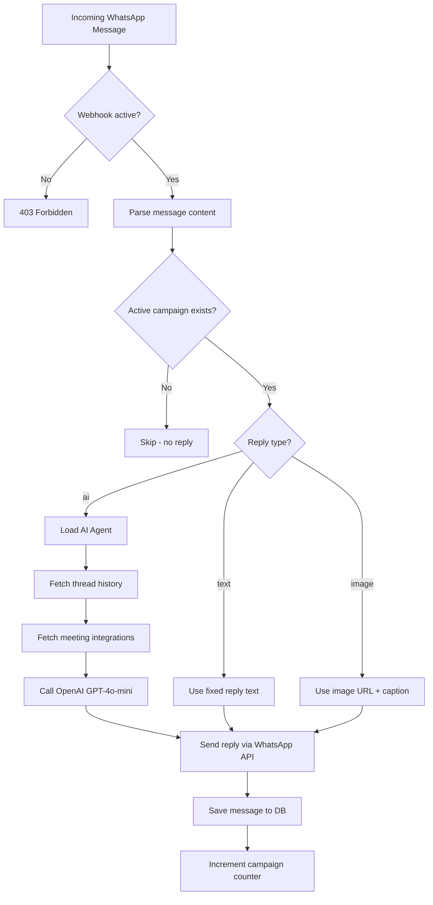

# Project W — Backend Walkthrough

## Overview

**Project W** is a **WhatsApp-based campaign automation platform** backend. It allows businesses to:
1. Connect their WhatsApp Business API credentials
2. Set up webhook endpoints to receive incoming WhatsApp messages
3. Create auto-reply campaigns (text, image, or AI-powered)
4. Manage AI agents powered by OpenAI GPT-4o-mini
5. Track all message conversations with thread history

---

## Tech Stack

| Layer | Technology |
|-------|-----------|
| **Runtime** | Node.js (ES Modules) |
| **Language** | TypeScript (strict mode) |
| **Framework** | Express.js |
| **ORM** | Drizzle ORM |
| **Database** | PostgreSQL (Supabase-compatible) |
| **Auth** | bcrypt password hashing (no JWT yet) |
| **AI** | OpenAI API (GPT-4o-mini) |
| **Deployment** | Render.com (free tier) |
| **Dev tooling** | tsx (watch mode), drizzle-kit |

---

## Architecture

```
Request → Routes → Controllers → Services → Database (Drizzle + PostgreSQL)
                       ↓
                   Utilities (validators, password hashing)
```

- **Routes** — Define HTTP endpoints and wire them to controllers
- **Controllers** — Handle HTTP req/res, validation, and call services
- **Services** — Business logic + database operations (static class methods)
- **Utilities** — Reusable helpers (email validation, password hashing)

---

## Project Structure

```
src/
├── index.ts                          # Express app entry point (CORS, JSON parsing, route mounting)
├── seed.ts                           # Database seeding script
├── run-migration.ts                  # Migration runner
├── check-migrations.ts               # Migration checker
│
├── routes/
│   ├── index.ts                      # Route aggregator (mounts all sub-routers under /api)
│   ├── health.routes.ts              # GET /api/check
│   ├── user.routes.ts                # /api/users/*
│   ├── wa-credential.routes.ts       # /api/wa-credentials/*
│   ├── webhook.routes.ts             # /api/webhook/*
│   ├── campaign.routes.ts            # /api/campaigns/*
│   ├── message.routes.ts             # /api/messages/*
│   ├── upload.routes.ts              # /api/uploads/*
│   └── ai-agent.routes.ts            # /api/ai-agents/* (includes integrations sub-routes)
│
├── controllers/
│   ├── health.controller.ts
│   ├── user.controller.ts            # Create, login, CRUD users
│   ├── wa-credential.controller.ts   # Manage WhatsApp API credentials
│   ├── webhook.controller.ts         # Webhook generation + WhatsApp message handler (core logic)
│   ├── campaign.controller.ts        # Campaign CRUD with mutual-exclusion activation
│   ├── message.controller.ts         # Message CRUD, thread listing, thread history
│   ├── upload.controller.ts          # Base64 image upload + serving
│   ├── ai-agent.controller.ts        # AI agent CRUD
│   └── ai-integration.controller.ts  # Meeting link integrations (Zoom, HubSpot, Google)
│
├── services/
│   ├── user.service.ts               # User DB ops + toSafeUser helper
│   ├── wa-credential.service.ts      # WA credential DB ops + toSafeCredential
│   ├── webhook.service.ts            # Webhook DB ops + token generation + URL generation
│   ├── campaign.service.ts           # Campaign DB ops + deactivateAll + incrementMessageCount
│   ├── message.service.ts            # Message DB ops + thread grouping (SQL subquery)
│   ├── upload.service.ts             # Upload DB ops + public URL generation
│   ├── whatsapp.service.ts           # WhatsApp Cloud API client (send text/image)
│   ├── ai-agent.service.ts           # AI agent DB ops + OpenAI GPT reply generation
│   └── ai-integration.service.ts     # AI integration (meeting links) upsert/delete
│
├── db/
│   ├── index.ts                      # Drizzle client setup (postgres-js driver)
│   └── schema/
│       ├── index.ts                  # Re-exports all schemas
│       ├── users.schema.ts
│       ├── wa-credentials.schema.ts
│       ├── webhook-configs.schema.ts
│       ├── campaigns.schema.ts
│       ├── messages.schema.ts
│       ├── uploads.schema.ts
│       ├── ai-agents.schema.ts
│       └── ai-integrations.schema.ts
│
├── types/
│   ├── env.d.ts                      # Process.env type declarations
│   └── database.types.ts             # Inferred Drizzle types (Select, Insert, Update, Safe)
│
└── utils/
    ├── validators.ts                 # Email/password validation, sanitization
    └── password.ts                   # bcrypt hash/compare
```

---

## Database Schema (9 Tables)

```mermaid
erDiagram
    users ||--o{ wa_credentials : "has"
    users ||--o{ webhook_configs : "has"
    users ||--o{ campaigns : "has"
    users ||--o{ messages : "has"
    users ||--o{ uploads : "has"
    users ||--o{ ai_agents : "has"
    ai_agents ||--o| ai_integrations : "has"
    ai_agents ||--o{ campaigns : "linked via"
    campaigns ||--o{ messages : "has"

    users {
        uuid id PK
        text email UK
        text password_hash
        text name
        timestamp created_at
        timestamp updated_at
    }

    wa_credentials {
        uuid id PK
        uuid user_id FK
        text business_id
        text phone_number_id
        text access_token
        text app_id
        text phone_number
        timestamp created_at
        timestamp updated_at
    }

    webhook_configs {
        uuid id PK
        uuid user_id FK
        text callback_url
        text verify_token UK
        boolean is_active
        timestamp created_at
        timestamp updated_at
    }

    campaigns {
        uuid id PK
        uuid user_id FK
        text name
        text reply_type
        text fixed_reply
        text reply_image_url
        uuid ai_agent_id FK
        boolean is_active
        integer message_count
        timestamp created_at
        timestamp updated_at
    }

    messages {
        uuid id PK
        uuid user_id FK
        uuid campaign_id FK
        text sender_number
        text message_type
        text message_content
        text reply_content
        text reply_status
        text whatsapp_message_id
        text reply_message_id
        timestamp received_at
        timestamp created_at
    }

    uploads {
        uuid id PK
        uuid user_id FK
        text file_name
        text mime_type
        integer file_size
        text file_data
        timestamp created_at
    }

    ai_agents {
        uuid id PK
        uuid user_id FK
        text name
        text agent_title
        text instructions
        boolean is_active
        integer message_count
        timestamp created_at
        timestamp updated_at
    }

    ai_integrations {
        uuid id PK
        uuid ai_agent_id FK_UK
        text zoom
        text hubspot
        text google
        timestamp created_at
        timestamp updated_at
    }
```

---

## API Endpoints (~30 routes)

### Health Check
| Method | Endpoint | Description |
|--------|----------|-------------|
| `GET` | `/api/check` | Server health check |

### Users
| Method | Endpoint | Description |
|--------|----------|-------------|
| `POST` | `/api/users/create` | Register new user |
| `POST` | `/api/users/login` | Login (email + password) |
| `GET` | `/api/users` | List all users |
| `GET` | `/api/users/:id` | Get user by ID |
| `PUT` | `/api/users/:id` | Update user |
| `DELETE` | `/api/users/:id` | Delete user |

### WhatsApp Credentials
| Method | Endpoint | Description |
|--------|----------|-------------|
| `POST` | `/api/wa-credentials/add` | Add WA Business API creds |
| `GET` | `/api/wa-credentials/user/:userId` | Get creds for user |
| `PUT` | `/api/wa-credentials/:id` | Update creds |
| `DELETE` | `/api/wa-credentials/:id` | Delete creds |

### Webhooks
| Method | Endpoint | Description |
|--------|----------|-------------|
| `POST` | `/api/webhook/generate` | Generate webhook config for user |
| `POST` | `/api/webhook/regenerate/:id` | Regenerate verify token |
| `GET` | `/api/webhook/config/:userId` | Get webhook config |
| `DELETE` | `/api/webhook/config/:id` | Delete webhook config |
| `GET` | `/api/webhook/:userId` | **Meta verification endpoint** |
| `POST` | `/api/webhook/:userId` | **Meta message handler** |

### Campaigns
| Method | Endpoint | Description |
|--------|----------|-------------|
| `POST` | `/api/campaigns` | Create campaign |
| `GET` | `/api/campaigns/user/:userId` | List campaigns for user |
| `GET` | `/api/campaigns/:id` | Get campaign by ID |
| `PUT` | `/api/campaigns/:id` | Update campaign |
| `DELETE` | `/api/campaigns/:id` | Delete campaign |

### Messages
| Method | Endpoint | Description |
|--------|----------|-------------|
| `POST` | `/api/messages` | Create message (manual/testing) |
| `GET` | `/api/messages/user/:userId` | All messages for user |
| `GET` | `/api/messages/campaign/:campaignId` | Messages by campaign |
| `GET` | `/api/messages/threads/:campaignId` | Thread list (grouped by sender) |
| `GET` | `/api/messages/thread/:campaignId/:senderNumber` | Full thread history |
| `GET` | `/api/messages/:id` | Get message by ID |
| `DELETE` | `/api/messages/:id` | Delete message |

### Uploads
| Method | Endpoint | Description |
|--------|----------|-------------|
| `POST` | `/api/uploads` | Upload image (base64) |
| `GET` | `/api/uploads/user/:userId` | List uploads for user |
| `GET` | `/api/uploads/:id/file` | **Serve image file** (public) |
| `DELETE` | `/api/uploads/:id` | Delete upload |

### AI Agents
| Method | Endpoint | Description |
|--------|----------|-------------|
| `POST` | `/api/ai-agents` | Create AI agent |
| `GET` | `/api/ai-agents/user/:userId` | List agents for user |
| `GET` | `/api/ai-agents/:id` | Get agent by ID |
| `PUT` | `/api/ai-agents/:id` | Update agent |
| `DELETE` | `/api/ai-agents/:id` | Delete agent |
| `GET` | `/api/ai-agents/:agentId/integrations` | Get meeting link integrations |
| `PUT` | `/api/ai-agents/:agentId/integrations` | Upsert meeting links |
| `DELETE` | `/api/ai-agents/:agentId/integrations` | Delete meeting links |

---

## Core Business Logic: Webhook Message Handler

The heart of the app is in [webhook.controller.ts](file:///Users/nexza/Documents/My%20Projects/Personal%20Projects/Project%20W/BE-projectW/src/controllers/webhook.controller.ts#L252-L387) — `handleWebhookByUserId`:



### Key behaviors:
- **Multi-tenant** — Each user gets their own webhook URL (`/api/webhook/:userId`)
- **Single active campaign** — Only one campaign can be active per user at a time
- **AI context** — AI replies include conversation history (configurable via `AI_HISTORY_MESSAGES` env var, default 5)
- **Meeting links** — AI agents can share Zoom/HubSpot/Google booking links when users express interest
- **Message types** — Handles text, image, document, audio, video, sticker, location, contacts

---

## Key Design Decisions

1. **No JWT auth yet** — Login returns user data but no token. The `middlewares/` directory is empty.
2. **Base64 image storage** — Images stored as base64 text in PostgreSQL (not cloud storage). Served via `/api/uploads/:id/file` with 1-year cache headers.
3. **WhatsApp Graph API v24.0** — Uses the latest Meta API version for sending messages.
4. **Single-activation pattern** — Both campaigns and AI agents use a pattern where activating one deactivates all others for that user.
5. **No rate limiting** — No middleware for rate limiting webhook calls or API requests.
6. **10 migrations applied** — Schema has evolved through 10 Drizzle migrations.

---

## Environment Variables

| Variable | Required | Description |
|----------|----------|-------------|
| `DATABASE_URL` | Yes* | PostgreSQL connection string |
| `PORT` | No | Server port (default from env) |
| `BASE_URL` | Yes | Public URL for webhook generation |
| `FRONTEND_URL` | No | CORS origin for frontend |
| `OPENAI_API_KEY` | For AI | OpenAI API key for GPT replies |
| `AI_HISTORY_MESSAGES` | No | Thread history limit (default: 5) |

> [!NOTE]
> `DB_HOST`, `DB_PORT`, `DB_USER`, `DB_PASSWORD`, `DB_NAME` can be used as fallback if `DATABASE_URL` is not set.

---

## What's Ready vs. What's Missing

### ✅ Implemented
- Full user management with password hashing
- WhatsApp credential management (multi-credential per user)
- Dynamic per-user webhook endpoints
- Campaign system with text/image/AI reply types
- AI agent management with OpenAI integration
- Meeting link integrations (Zoom, HubSpot, Google Calendar)
- Message storage with thread-based conversation view
- Image upload & serving
- Render.com deployment config

### ⚠️ Not Yet Implemented
- **Authentication middleware** (JWT/session-based) — `middlewares/` is empty
- **Authorization** — No ownership checks (any user can access any resource by ID)
- **Rate limiting** — No protection against abuse
- **Input validation middleware** — Validation is inline in controllers
- **Error handling middleware** — Errors caught per-controller, no global handler
- **Access token encryption** — WA credentials stored as plaintext
- **Contact management** — Schema mentioned in README but not implemented
